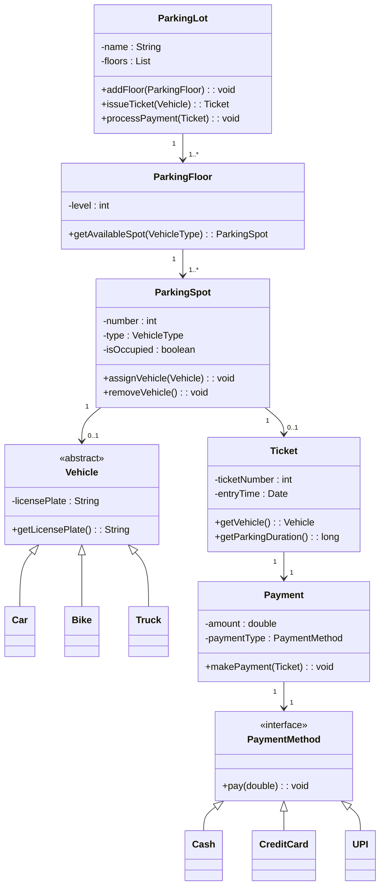

# Parking Lot Design

```java

// Vehicle abstraction
abstract class Vehicle {
    private String licensePlate;
    public Vehicle(String licensePlate) { this.licensePlate = licensePlate; }
    public String getLicensePlate() { return licensePlate; }
}

class Car extends Vehicle { public Car(String lp) { super(lp); } }
class Bike extends Vehicle { public Bike(String lp) { super(lp); } }
class Truck extends Vehicle { public Truck(String lp) { super(lp); } }

// Parking Spot
class ParkingSpot {
    private Vehicle vehicle;
    private boolean isAvailable = true;

    public void park(Vehicle v) {
        this.vehicle = v;
        this.isAvailable = false;
    }

    public void freeSpot() {
        this.vehicle = null;
        this.isAvailable = true;
    }

    public boolean isAvailable() { return isAvailable; }
}

// Ticket
class Ticket {
    private Vehicle vehicle;
    private long entryTime;

    public Ticket(Vehicle v) {
        this.vehicle = v;
        this.entryTime = System.currentTimeMillis();
    }

    public Vehicle getVehicle() { return vehicle; }
    public long getEntryTime() { return entryTime; }
}

// Parking Lot
class ParkingLot {
    private List<ParkingSpot> spots;

    public ParkingLot(int capacity) {
        spots = new ArrayList<>();
        for(int i=0; i<capacity; i++) spots.add(new ParkingSpot());
    }

    public Ticket parkVehicle(Vehicle v) {
        for(ParkingSpot spot : spots) {
            if(spot.isAvailable()) {
                spot.park(v);
                return new Ticket(v);
            }
        }
        throw new RuntimeException("No spots available!");
    }

    public void exitVehicle(Ticket ticket) {
        for(ParkingSpot spot : spots) {
            if(!spot.isAvailable() && spot.vehicle == ticket.getVehicle()) {
                spot.freeSpot();
                System.out.println("Payment processed for " + ticket.getVehicle().getLicensePlate());
                return;
            }
        }
    }
}

```



| Principle                                                                       | Application in Design                                                                                     | Example                                               |
|---------------------------------------------------------------------------------|-----------------------------------------------------------------------------------------------------------|-------------------------------------------------------|
| **[Single Responsibility Principle](ca://s?q=Single_Responsibility_Principle)** | Each class has one job — e.g., ``ParkingSpot`` only manages spot state, ``Payment`` only handles payment. | Separation of concerns between ticketing and payment. |
| **[Open/Closed Principle](ca://s?q=Open_Closed_Principle)**                     | New vehicle types or payment methods can be added without modifying existing classes.                     | Add ``EVCar`` or ``CryptoPayment`` easily.            |
| **[Liskov Substitution Principle](ca://s?q=Liskov_Substitution_Principle)**     | Subclasses (``Car``, ``Bike``, ``Truck``) can replace ``Vehicle`` without breaking functionality.         | All vehicles share common interface.                  |
| **[Interface Segregation Principle](ca://s?q=Interface_Segregation_Principle)** | ``PaymentMethod`` interface ensures clients depend only on what they need.                                | Each payment type implements ``pay()`` differently.   |
| **[Dependency Inversion Principle](ca://s?q=Dependency_Inversion_Principle)**   | ``Payment`` depends on the ``PaymentMethod`` abstraction, not concrete classes.                           | Promotes flexibility and testability.                 |