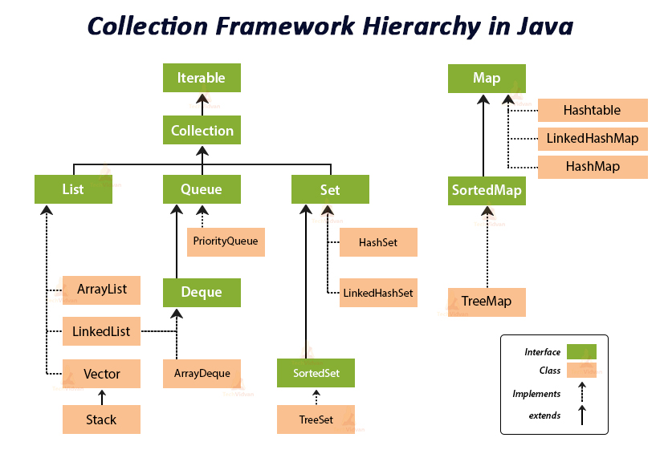

**1. basic interfaces of Java Collections Framework?**


**2. Why Collection does not extend Cloneable and Serializable interfaces?**
- cloning or serialization come into play when dealing with actual implementations. Thus, the concrete implementations of collections should decide how they can be cloned or serialized.

**3. What is an Iterator?**
- The Iterator interface provides a number of methods that are able to iterate over any Collection. 
- Each Java Collection contains the iterator method that returns an Iterator instance. 
- Iterators are capable of removing elements from the underlying collection during the iteration.

**4. Iterator vs ListIterator?**
- Iterator 
	- An Iterator can be used to traverse the Set and List collections
	- Traverse only in forward direction
- List iterator 
	- ListIterator can be used to iterate only over Lists.
	- Traverse in both direction 
	- listIterator extents Iterator 
	- Added - such as adding an element, replacing an element, getting the index position for previous and next elements, etc.

**5. fail-fast vs fail-safe ?**
- fail-safe 
	- The Iterator’s fail-safe property works with the clone of the underlying collection and thus, it is not affected by any modification in the collection.
	- collection classes in java.util.concurrent are fail-safe
	- never throws ConcurrantModificaionException 
	- Example
	```java
	import java.util.concurrent.CopyOnWriteArrayList; 
	import java.util.Iterator;
	
	class FailSafe {
		public static void main(String args[]){
			CopyOnWriteArrayList<Integer> list= new CopyOnWriteArrayList<Integer>(new Integer[] { 1, 3, 5, 8 });
			Iterator itr = list.iterator();
			while (itr.hasNext()) {
				Integer no = (Integer)itr.next();
				System.out.println(no);
				if (no == 8)
	
	                // This will not print, 
	                // hence it has created separate copy 
	                list.add(14); 
	        } 
	    } 
	}
 
	/*
		1
		3
		5
		8
 	*/
	```

- Fail-fast
	- Fail-fast iterators throw a ConcurrentModificationException
	- All the collection classes in java.util package are fail-fast
	- Example 
	```java
	import java.util.HashMap; 
	import java.util.Iterator;
	import java.util.Map;
	
	public class FailFastExample {
		public static void main(String[] args){
 
		Map<String, String> cityCode = new HashMap<String, String>();
		cityCode.put("Delhi", "India");
		cityCode.put("Moscow", "Russia");
		cityCode.put("New York", "USA");
	
	    Iterator iterator = cityCode.keySet().iterator(); 
	  
	    while (iterator.hasNext()) { 
	        System.out.println(cityCode.get(iterator.next())); 
	  
	        // adding an element to Map 
	        // exception will be thrown on next call 
	        // of next() method. 
	        cityCode.put("Istanbul", "Turkey"); 
	        } 
	    } 
	}

	//India
	//Exception in thread "main" java.util.ConcurrentModificationException
	//at java.util.HashMap$HashIterator.nextNode(HashMap.java:1442)
	//at java.util.HashMap$KeyIterator.next(HashMap.java:1466)
	//at FailFastExample.main(FailFastExample.java:18)
	```


**6. Importance of hashCode and equals method ?**
- equals():
  - It checks the equality of two objects. It compares the Key, whether they are equal or not.
  - It is a method of the Object class. It can be overridden.
  - If you override the equals() method, then it is mandatory to override the hashCode() method.
- hashCode():
  - This is the method of the object class.
  - It returns the memory reference of the object in integer form.


**7. How hash-map works ?**
- It implements the map interface. It stores the data in the pair of Key and Value.  
- HashMap uses technic called Hashing
- HashMap contains an array of Node and Node can represent a class having following objects :
```
int hash
K key
V value
Node next
```
- Buckets: Array of the node is called buckets. Each node has a data structure like a LinkedList. More than one node can share the same bucket. It may be different in capacity.
- Insert Key, Value pair in HashMap
	- We use put() method to insert the Key and Value pair in the HashMap. 
	- The default size of HashMap is 16 (0 to 15).
	```java
		HashMap<String, Integer> map = new HashMap<>();  
		map.put("Aman", 19);  
		map.put("Sunny", 29);  
		map.put("Ritesh", 39);  
	```
 	- Let's see at which index the Key, value pair will be saved into HashMap. 
	  When we call the put() method, then it calculates the hash code of the Key "Aman." Suppose the hash code of "Aman" is 2657860. To store the Key in memory, we have to calculate the index.
	- `Index = hashcode(Key) & (n-1)  `
		- Index = 2657860 & (16-1) = 4
		  
	- Hash Collision
		- This is the case when the calculated index value is the same for two or more Keys.
		- Let's calculate the hash code for another Key "Sunny." Suppose the hash code for "Sunny" is 63281940. To store the Key in the memory, we have to calculate index by using the index formula.
		- `Index=63281940 & (16-1) = 4  `
		- The value 4 is the computed index value where the Key will be stored in HashMap. In this case, equals() method check that both Keys are equal or not. If Keys are same, replace the value with the current value. Otherwise, connect this node object to the existing node object through the LinkedList. Hence both Keys will be stored at index 4.
		  
- get() method in HashMap
	- get() method is used to get the value by its Key. It will not fetch the value if you don't know the Key. When get(K Key) method is called, it calculates the hash code of the Key.
	- `map.get(new Key("Aman"));  `
	- It generates the hash code as 2657860. Now calculate the index value of 2657860 by using index formula. The index value will be 4, as we have calculated above. get() method search for the index value 4.
	- It compares the first element Key with the given Key. If both keys are equal, then it returns the value else check for the next element in the node if it exists.
	

**8. Comparable vs Comparator**
- Comparable 
	- compareTo()
	- compares two objects, inorder to implose an order between them
	- Specifically, it returns a negative integer, zero, or a positive integer to indicate that the input object is less than, equal or greater than the existing object.
- Comparator 
	- compare() & equals()
	- The first method compares its two input arguments and imposes an order between them.
	- It returns a negative integer, zero, or a positive integer to indicate that the first argument is less than, equal to, or greater than the second.
	- The second method requires an object as a parameter and aims to decide whether the input object is equal to the comparator. The method returns true, only if the specified object is also a comparator and it imposes the same ordering as the comparator.

**9. Java Priority Queue ?**
- The PriorityQueue is an unbounded queue, based on a priority heap and its elements are ordered in their natural order.
- At the time of its creation, we can provide a Comparator that is responsible for ordering the elements of the PriorityQueue.
- A PriorityQueue does not allow null values, those objects that do not provide natural ordering or those objects that do not have any comparator associated with them
- Finally, the Java PriorityQueue is not thread-safe and it requires O(log(n)) time for its enqueuing and dequeuing operations.
- When to use ?

**10. Trade-off between using an unordered array versus an ordered array?**
- The major advantage of an ordered array is that the search times have time complexity of O(log n), compared to that of an unordered array, which is O (n).
- The disadvantage of an ordered array is that the insertion operation has a time complexity of O(n), because the elements with higher values must be moved to make room for the new element. Instead, the insertion operation for an unordered array takes constant time of O(1).

**11. Enumeration vs Iterator interfaces?**
- Enumeration is twice as fast as compared to an Iterator and uses very less memory.
- Iterator is much safer compared to Enumeration, because other threads are not able to modify the collection object that is currently traversed by the iterator. Also, Iterators allow the caller to remove elements from the underlying collection, something which is not possible with Enumerations.

**12. Set comparison**


**13. Maps comparison**


**14. Array vs ArrayList** 
- Array 
	- Only primitive (int, float)
	- Fixed size
- ArrayList 
	- Only objects 
	- Dynamic
	- Provide methods 

**15. ArrayList vs LinkedList**
- ArrayList
	- implements list
	- Index based DS (?)
	- Provides random access with performance O(1). How to calcutae complexity ?
	- Insertion, addition and removal is slow because arrays and index based, so need to update index and resize
- LinkedList
	- Stores its data as list of elements and every element is linked to its previous and next element. 
	- the search operation for an element has execution time equal to O(n).
	- implements list	
	- The Insertion, addition and removal operations of an element are faster in a LinkedList
	- A LinkedList consumes more memory than an ArrayList, because every node in a LinkedList stores two references, one for its previous element and one for its next element.

**16. Which Collection to use?**


**17. What are different ways of iterating over elements in List?**
- Create ArrayList
```java 
 List<String> arrayList=new ArrayList<String>(); 
 arrayList.add("javaMadeSoEasy");
```
1. Iterate over elements in ArrayList using iterator()
- iterator returned by ArrayList is fail-fast.
```java
Iterator<String> iterator=arrayList.iterator();
    while(iterator.hasNext()){
       System.out.println(iterator.next());
}
```
2. Iterate over elements in ArrayList using listIterator()
- ListIterator returned by ArrayList is also fail fast.
```java
ListIterator<String> listIterator=arrayList.listIterator();
```
3. Iterate over elements in list using enumeration
- Enumeration is also fail-fast.
```java
Enumeration<String> listEnum=Collections.enumeration(arrayList); 
    while(listEnum.hasMoreElements()){
       System.out.println(listEnum.nextElement()); 
    }
```
4. Iterate over elements in list using enhanced for loop
- enhanced for loop is also fail-fast.
```java
for (String string : arrayList) {
       System.out.println(string);
}
```

**18. What are different ways of iterating over elements in Set?**
Creating HashSet and add element.

```java
Set<String> hashSet=new HashSet<String>();
hashSet.add("javaMadeSoEasy");
```

1. Iterate over elements in HashSet using iterator()
- iterator returned by HashSet is fail-fast.
```java
		Iterator<String> iterator=hashSet.iterator();
		while(iterator.hasNext()){
		System.out.println(iterator.next());
		}
```

2. Iterate over elements in Set using enumeration
- enumeration is also fail-fast.
```java
Enumeration<String> listEnum=Collections.enumeration(set);   
while(listEnum.hasMoreElements()){
System.out.println(listEnum.nextElement());
}
```

3. Iterate over elements in Set using enhanced for loop
- enhanced for loop is also fail-fast.
```java
		for (String string : set) {
		System.out.println(string);
		}
```

**19. What are different ways of iterating over keys, values and entry in Map?**

- Create and put key-value pairs in HashMap
```java
Map<Integer,String> hashMap=new HashMap<Integer,String>();        
hashMap.put(11, "javaMadeSoEasy");
hashMap.put(21, "bmw");
hashMap.put(31, "ferrari");
```

1A. Iterate over keys -
- hashMap.keySet().iterator() method returns iterator to iterate over keys in HashMap.

```java
Iterator<Integer> keyIterator=hashMap.keySet().iterator();
while(keyIterator.hasNext()){
System.out.println(keyIterator.next());
}

/*OUTPUT
21
11
31
*/

```   

1B. Iterate over values -
- hashMap.values().iterator() method returns iterator to iterate over keys in HashMap.
- iterator returned is fail-fast.
```java
Iterator<String> valueIterator=hashMap.values().iterator();
while(valueIterator.hasNext()){
System.out.println(valueIterator.next());
}

/*OUTPUT
javaMadeSoEasy
audi
ferrari
*/

```

2. Iterate over Entry-
- hashMap.entrySet().iterator() method returns iterator to iterate over keys in HashMap.
- iterator returned is fail-fast..

```java
Iterator<Entry<Integer, String>> entryIterator=hashMap.entrySet().iterator();  
while(entryIterator.hasNext()){
System.out.println(entryIterator.next());
}

/*OUTPUT
21=javaMadeSoEasy
11=audi
31=ferrari
*/
```
