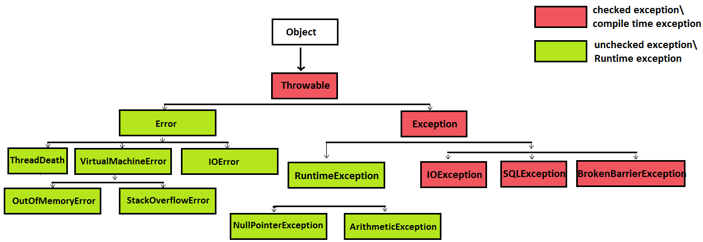

**1. What is exception in java?**
- An exception is an event, which occurs during the execution of a program, that disrupts the normal flow of the program's instructions. 
  
**2. Exception hierarchy**

3. Difference between checked & unchecked exception 
- Runtime - Unchecked, Compiletime- checked 
- need to be taken care at runtime, need to be taken care at compile time 
- Whenever runtime exception occurs execution of program is interrupted, We cannot proceed until we fix compilation issues
- class UserException extends RuntimeException , class UserException extends Exception 
- unchecked exceptions are automatically propagated,  For propagating checked exceptions method must throw exception by using throws keyword.

4. Handling checked and unchecked exception while overriding superclass method
- If superclass method throws/declare unchecked >

    overridden method of subclass can declare/throw any unchecked /RuntimeException (superclass or subclass), or
    overridden method of subclass cannot declare/throw any checked exception,

1st condition --

class SuperClass{
    void method() throws NullPointerException{
           System.out.println("superClass method");
    }
}

class SubClass extends SuperClass{
    void method() throws RuntimeException{
           System.out.println("SubClass method");
    }
}

2nd condition --

class SuperClass{
    void method() throws NullPointerException{
           System.out.println("superClass method");
    }
}

class SubClass extends SuperClass{
    void method() throws Exception{ // Compiler is crying
           System.out.println("SubClass method");
    }
}

-  If superclass method throws/declare checked exception >

    overridden method of subclass can declare/throw narrower (subclass of) checked exception, or
    overridden method of subclass cannot declare/throw broader (superclass of) checked exception, or
    overridden method of subclass can declare/throw any unchecked /RuntimeException

1st Condition - 

 class SuperClass{
    void method() throws IOException{
           System.out.println("superClass method");
    }
}
 
class SubClass extends SuperClass{
    void method() throws FileNotFoundException{
           System.out.println("SubClass method");
    }
}

2nd Condition 

 class SuperClass{
    void method() throws IOException{
           System.out.println("superClass method");
    }
}
 
class SubClass extends SuperClass{
    void method() throws Exception{ // Compiler crying 
           System.out.println("SubClass method");
    }
}

3rd Condition 
class SuperClass{
    void method() throws IOException{
           System.out.println("superClass method");
    }
}
 
class SubClass extends SuperClass{
    void method() throws NullPointerException{
           System.out.println("SubClass method");
    }
}

5.  Which classes are which type of exception? either checked or unchecked exception?
-  The class Exception and all its subclasses that are not also subclasses of RuntimeException are checked exceptions in java.
-  The class RuntimeException and all its subclasses are unchecked exceptions.Likewise, The class Error and all its subclasses are unchecked exceptions in java.

6.  What are 5 exception handling keywords in java? 
try - Any exception occurring in try block is catched by catch block.
catch - catch block is always followed by try block in java.
finally - block can can only exist if try or try-catch block is there, finally block can’t be used alone in java.
Features of finally >
    finally block is always executed irrespective of exception is thrown or not.
    finally is keyword in java.
    finally block is optional in java, we may use it or not.

finally block is not executed in following scenarios >
    finally is not executed when System.exit is called.
    if in case JVM crashes because of some java.util.Error. 

throw is a keyword in java. throw keyword allows us to throw checked or unchecked exception.
throws is written in method’s definition to indicate that method can throw exception in java.

7. Explain what is Error in java?
- java.lang.Error 
- Error is a subclass of Throwable  in java.
- Error indicates some serious problems that our application should not try to catch in java. 
- Error and its subclasses are regarded as unchecked exceptions in java 
-  Application must not catch the Error because they does cause any major threat to application. Example - OutOfMemoryError and StackOverflowError 

8.  throw 
- throw keyword allows us to throw checked or unchecked exception.
- We need to handle checked exception either by catching it, or 
- throwing it by using throws keyword. (When thrown, exception must be handled in calling environment)

9. Explain throws keyword in java?
- throws is written in method’s definition to indicate that method can throw exception.
- We need not to handle unChecked exception either by catching it or throwing it.
- A code m() throws NullPointerException (unChecked exception) and didn’t handled it from where method m() was called and no compilation error was thrown. // Compiler did not cry.
- We need to handle checked exception either by catching it or throwing it further, if not handled we will face compilation error.
	- Compiler will cry in case of throws FileNotFoundException & if not handled 

10. How to use try-catch-finally in java? Can we use try,catch or finally block alone in java?
- try-catch block, or
- try-finally block, or
- try-catch-finally block.

11.  Is it allowed to use multiple catch block in java?
Yes
- Exception class handled in starting catch block must be subclass of Exception class handled in following catch blocks (otherwise we will face compilation error).
- Either one of the multiple catch block will handle exception at time in java. 

12. What is Automatic resource management in java 7?
-  multi catch syntax which helps in automatic resource management.
-  Allows us to catch more than one exception in one catch block.
try{
       //code . . . . . 
}catch(IOException | SQLException ex){
       //code . . . . .
}     
-If Multi catch syntax is used to catch subclass and its superclass than compilation error will be thrown.
- The exception IOException is already caught by the alternative Exception”.
- catch(IOException | Exception ex){ // Compiler will cry
       //code . . . . .
} 

13.  Explain try-with-resource in java?
- Before java 7, we used to write explicit code for closing file in finally
- Example - 
finally{
      if(inputStream!=null)
      inputStream.close();
}
- try-with-resource 
-  try (InputStream inputStream = new FileInputStream("c:/txtFile.txt")) {
              //code...
}

14. why we need not to close file when we are using Try-with-resources in java?
-  implements java.lang.AutoCloseable interface (AutoCloseable interface’s close method automatically closes resources which are no longer needed)

15.  Which classes can be used inside Try-with-resources in java?
- All the classes which implements AutoCloseable interface can be used inside Try-with-resources in java.

16.  Is it allowed to use nested try-catch in java?
- Yes.

17. Discuss which checked and unchecked exception can be thrown/declared by subclass method while overriding superclass method in java?
If superclass method throws/declare unchecked/RuntimeException in java >

    overridden method of subclass can declare/throw any unchecked /RuntimeException (superclass or subclass), or (Proven)
    overridden method of subclass cannot declare/throw any checked exception in java, or (Proven)
    overridden method of subclass may not declare/throw any exception in java.

If superclass method throws/declare checked/compileTime exception in java >

    overridden method of subclass can declare/throw narrower (subclass of) checked exception, or (Proven)
    overridden method of subclass cannot declare/throw broader (superclass of) checked exception, or (Proven)
    overridden method of subclass can declare/throw any unchecked /RuntimeException, or (Proven)
    overridden method of subclass may not declare/throw any exception in java.

If superclass method does not throw/declare any exception in java >

    overridden method of subclass can declare/throw any unchecked /RuntimeException , or
    overridden method of subclass cannot declare/throw any checked exception, or
    overridden method of subclass may not declare/throw any exception in java.

18.  What will happen when catch and finally block both return value, also when try and finally both return value in java?
-  When catch and finally block both return value, method will ultimately return value returned by finally block irrespective of value returned by catch block.
- Likewise, when try and finally block both return value, method will ultimately return value returned by finally block irrespective of value returned by try block. 

19. What is exception propagation in java?
-  Whenever methods are called stack is formed and an exception is first thrown from the top of the stack and if it is not caught, it starts coming down the stack to previous methods until it is not caught. 

20. Can a catch or finally block throw exception in java?
- Yes, catch or finally block can throw checked or unchecked exception but it must be handled accordingly. 

21.Why shouldn’t you use Exception for catching all exceptions in java?
-Catching Exception rather than handling specific exception can be vulnerable to our application. Multiple catch blocks must be used to catch specific exceptions

22. Order in multi catch ?

23.  can a method be overloaded on basis of  exceptions in java ?
-  Yes a method be overloaded on basis of  exceptions in java.
- Let's say one method handles Exception and other handles ArithmeticException. Which method will be invoked when ArithmeticException is thrown?
-  Method which handles more specific exception will be called.

24.What are the differences between between ClassNotFoundException and NoClassDefFoundError in java ?
ClassNotFoundException 
	-  ClassNotFoundException is Checked (compile time) Exception in java.
	-  ClassNotFoundException is thrown when JVM tries to class from classpath but it does not find that class.

NoClassDefFoundError 
	- NoClassDefFoundError is a Error in java. hence unchecked 
	- NoClassDefFoundError is thrown when JVM tries to load class which > was NOT available at runtime but was available at compile time.

